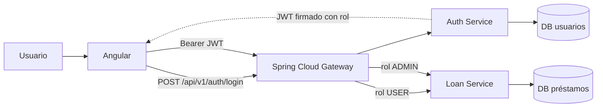

# Arquitectura bancaria: Angular + Java

## Componentes

- **Angular SPA**: login y paneles distintos para `USER` y `ADMIN`. Consume `/api/**` mediante el gateway y mantiene el JWT en memoria.
- **Spring Cloud Gateway**: punto de entrada único. Valida JWT y rol antes de enrutar solicitudes.
- **Auth Service**: consulta su propia base de usuarios, verifica contraseñas BCrypt y emite JWT con rol y expiración.
- **Loan Service**: crea y consulta solicitudes; los administradores pueden aprobarlas o rechazarlas.
- **Persistencia**: Auth Service y Loan Service poseen bases independientes. Compose usa PostgreSQL; el modo local usa H2.

## Capas MVC

- **Model**: entidades y DTOs Java en `model`; modelos TypeScript de cuenta y préstamo en `frontend/src/app/models`.
- **View**: plantilla y estilos Angular en `frontend/src/app/views`.
- **Controller**: controladores REST en cada `controller`; `LoanPortalComponent` conecta eventos de la vista con los servicios Angular.
- **Service**: reglas de autenticación y préstamos en los paquetes Java `service`; los servicios Angular encapsulan llamadas HTTP.
- **Repository**: acceso a PostgreSQL/H2 mediante Spring Data JPA en `repository`.

Los controladores coordinan solicitudes HTTP, pero no realizan consultas JPA ni contienen las reglas de negocio. Angular presenta JSON detrás del API Gateway; el backend no renderiza vistas HTML.

## Autorización

1. Angular envía credenciales a `POST /api/v1/auth/login`.
2. Auth Service busca el usuario, verifica el hash BCrypt y emite un JWT con rol `USER` o `ADMIN`.
3. Angular envía `Authorization: Bearer <token>` en las llamadas protegidas.
4. Gateway y Loan Service validan firma, emisor, expiración y rol.
5. `USER` puede consultar `GET /api/v1/loans/my` y crear solicitudes con `POST /api/v1/loans`.
6. `ADMIN` puede consultar `GET /api/v1/admin/loans` y decidir solicitudes con `PATCH /api/v1/admin/loans/{id}/decision`.

## Datos de desarrollo

- `usuario@test.com` / `123` tiene rol `USER`.
- `admin@test.com` / `123` tiene rol `ADMIN`.
- Los usuarios se crean en la base de Auth Service si aún no existen. Las contraseñas nunca se guardan en texto plano.
- Los préstamos pertenecen a la base separada de Loan Service.

Estas cuentas y la clave JWT predeterminada son únicamente para desarrollo. Producción requiere credenciales robustas, secretos externos y preferiblemente OIDC o firma asimétrica. La interfaz no implementa una evaluación financiera real; análisis de solvencia, tasas, amortización y auditoría requieren definición de negocio.

## Ejecución

- **Sin Docker**: Auth Service y Loan Service usan perfiles `local` con H2. Se ejecutan cuatro procesos: Auth Service, Loan Service, gateway y Angular. Los comandos están en `README.md`.
- **Compose**: frontend, gateway, ambos servicios y dos instancias PostgreSQL con volúmenes separados.